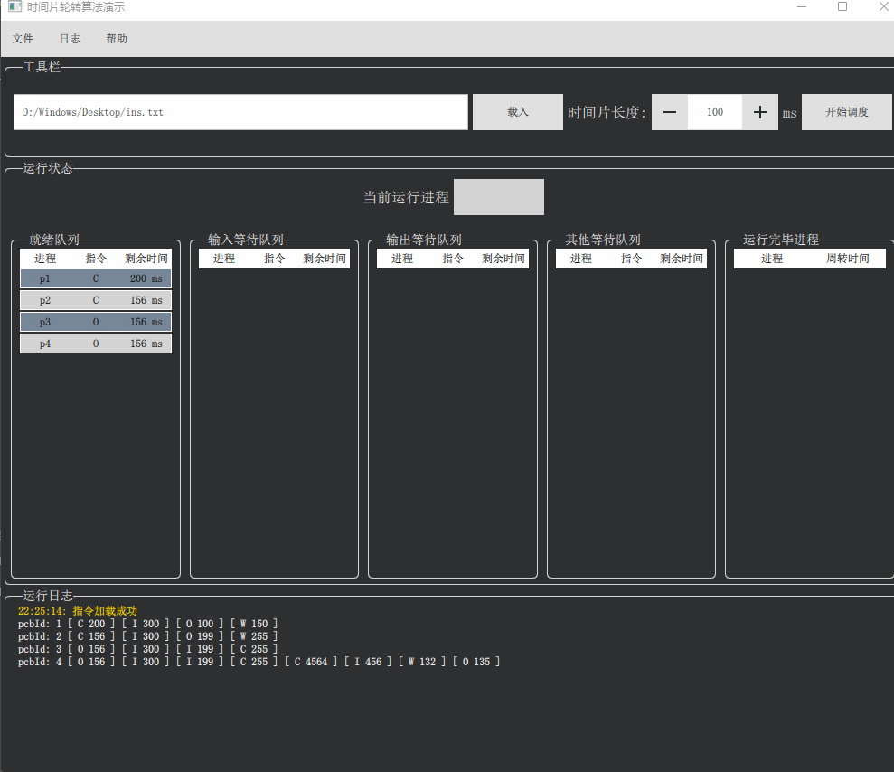
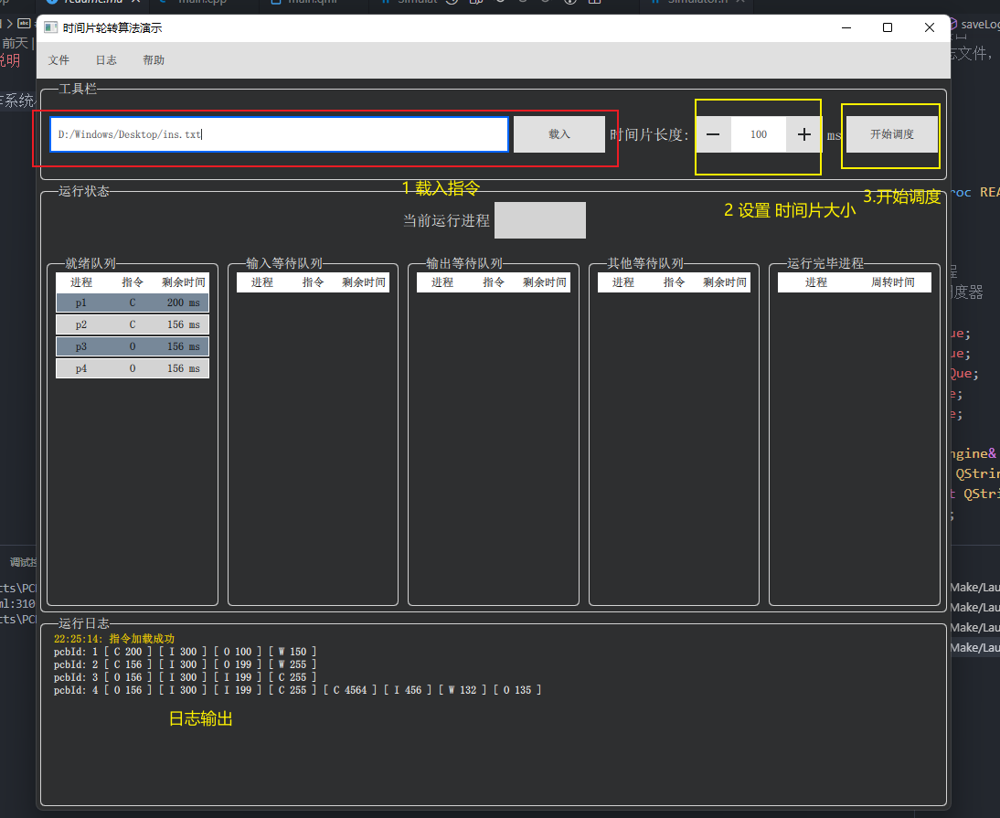

# 介绍

操作系统小作业： 时间轮转算法的模拟实现


## 题目要求

1. 一个进程可以执行四种指令C I O W 分别代表指令 ： 占用CPU  、读入 、输出、等待，来表示模拟现实生活中的程序需要的操作
2. C指令会占用CPU（处理机）且一个时刻只有一个进程执行C指令，而其他指令都不会占用CPU,并且假设I/O设备的数量没有限制，I和O设备都只有一类。这就意味着假设四种指令对应四个任务队列，也只有执行C的队列需要等待，其他队列都是并行的。
3. 执行C指令的队列需要使用**时间轮转调度算法**
## 使用说明

### 指令文件

例子：

```tex
P C200 I300 O100 W150 H
P C156 I300 O199 W255 H
P O156 I300 I199 C255  H
P O156 I300 I199 C255   C4564 I456 W132 O135 H
```
补充：换行空格不影响，每一个进程至少有一条指令

1. P 和 H 分别标记一个进程的开始和结束
2. `C I O W` 分别代表指令 ： 占用CPU  、读入 、输出、等待
3. 指令后面的数值代表 运行时间 单位 ms

### 效果



### 使用流程

1. 载入指令文件
2. 设置时间片大小
3. 开始调度




## 开发环境Q

- Qt5.15.2
- mingw64
- qml2

## 项目结构

本次作业采用Qt Quick技术实现，Qt Quick 写界面逻辑使用的Qml语言，使用Qml写界面是非常便利的，QML和现在的H5结合C++架构没什么区别，都是标记语言前端和强类型语言后端的组合，可以简单的写出一些炫酷的动画和特效，支持触屏，无论是学起来还是用起来都很简单方便。但是做到这一点需要开发者能够与熟练将Qml和C++ 结合起来，做到前后端分离，Qml的无法处理复杂的操作，关键的模拟进程调度还是得靠C++来完成。
同时,界面程序在模拟线程调度的时候，主界面难免会有延迟或者卡死，这里引入多线程操作。

```tex
└─source
    ├─Model  //model
    ├─qml    //qml 文件
    ├─Scheduler//时间轮转算法调度器
    └─Simulator //模拟
```


